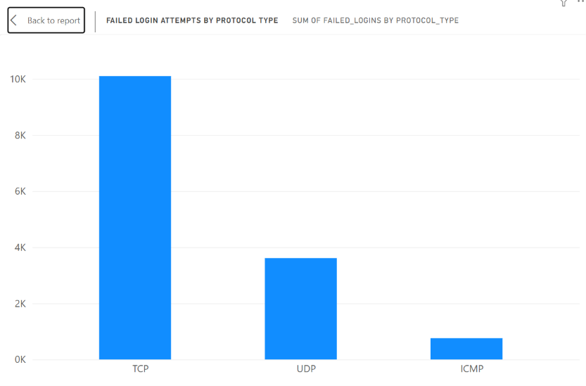

# SQL User Access Log Analyser

## Problem
Companies need to spot suspicious logins early, like repeated failed logins, logins at odd hours or sessions with weak security.
In this project I used SQL to look for these patterns in 9,537 simulated login sessions.
I also checked whether each pattern actually led to more attacks.

## What I Did
- Loaded a public intrusion-detection dataset into MySQL
- Checked the data first (blanks, duplicates, value ranges)
- Wrote SQL queries to flag risky sessions
- Compared attack rates for flagged and not flagged sessions
- Used the data to pick my thresholds
- Made charts in Power BI

## Data Checks
| Check | Result |
|---|---|
| Missing values | 0 |
| Duplicate session IDs | 0 |
| failed_logins range | 0 to 5 |
| ip_reputation_score range | 0.0025 to 0.924 |

The data was complete and had no duplicates, so I could use all rows.

## Key Findings
| Finding | Count | % of 9,537 Sessions |
|---|---|---|
| Repeated failed logins (3+) | 1,584 | 16.6% |
| Unusual/off-hours access | 1,430 | 15.0% |
| No encryption + high-risk IP | 368 | 3.9% |
| Sessions labelled as attacks in the dataset | 4,264 | 44.7% |

## Do the Flags Predict Attacks?
| Flag | Attack rate if flagged | Attack rate if not flagged | Result |
|---|---|---|---|
| 3+ failed logins | 100.0% | 33.7% | Strong |
| No encryption + high-risk IP | 66.8% | 43.8% | Moderate |
| Off-hours access | 45.7% | 44.5% | Weak |

## How I Chose the Thresholds
- 3 failed logins: the attack rate was about 34% for 0, 1 and 2 failed logins, then went to 100% at 3.
- IP score above 0.5: the attack rate was about 40% below 0.5, then went up to 63.7% between 0.5 and 0.75, and 100% above 0.75.

## Failed Logins by Protocol

TCP had the most failed logins (10,101), then UDP (3,613) and ICMP (761).

## What This Means for Audit
These results relate to access controls, which are part of IT general controls (ITGCs).
If this was a real company, I would check:
- Failed logins: do accounts lock after a few failed attempts, and is MFA used? This was the strongest flag.
- No encryption + high-risk IP: is encryption required, and are risky IPs blocked or flagged?
- Off-hours access: this flag alone made almost no difference, so an alert based only on time would give a lot of false alarms. It should be used with other flags.
- Log review: are access logs checked regularly, not only after something goes wrong?

## Limitations
- The data is simulated, so it is cleaner than real logs. The 100% result for 3+ failed logins is probably because of how the data was made.
- The attack label comes from the dataset. I did not find the attacks myself; I used the label to test my flags.
- There is no user or role data, so I could not check segregation of duties.
- There are no dates or times, so I could not look at trends.

## How to Run
1. Download the dataset from Kaggle (link below).
2. Run the setup part of audit_queries.sql to create the database and table.
3. Import the CSV into session_data using the MySQL Workbench import wizard.
4. Run the other queries in order.

## Files
- audit_queries.sql: all my SQL queries
- chart_indicator_test.png: attack rate for flagged vs not flagged sessions
- chart_failed_logins.png: failed logins by protocol

## Tools Used
MySQL, MySQL Workbench, Power BI

## Dataset
Cybersecurity Intrusion Detection Dataset (Kaggle):
https://www.kaggle.com/datasets/dnkumars/cybersecurity-intrusion-detection-dataset
