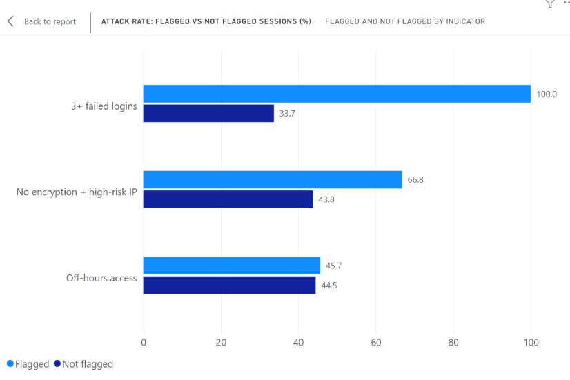
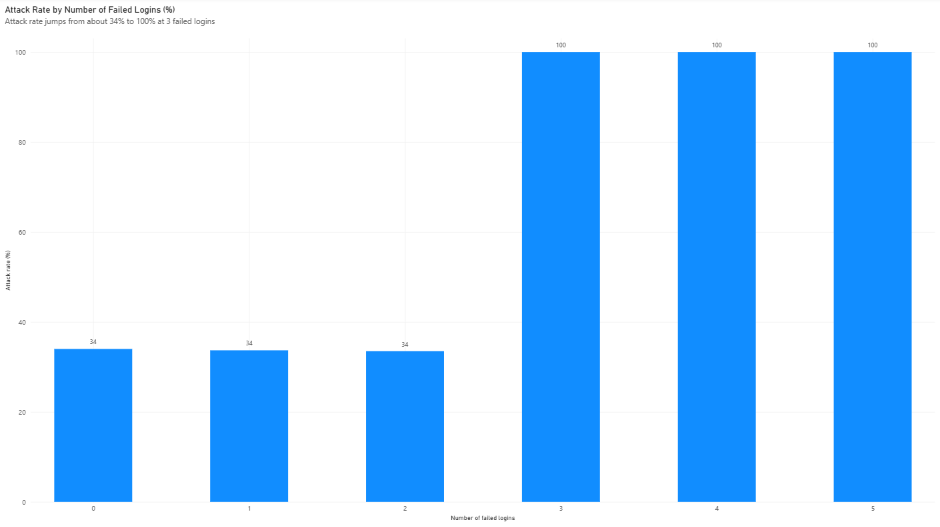

# SQL User Access Log Analyser

**In short:** I used SQL to flag risky logins and checked if each flag really predicted attacks. 3+ failed logins was the strongest flag. Off-hours access on its own did not help much. Sessions with 2 or more flags were almost always attacks.

## Problem
Companies need to spot suspicious logins early, like repeated failed logins, logins at odd hours or sessions with weak security.
I used SQL to look for these patterns in 9,537 simulated login sessions and checked whether each pattern actually led to more attacks.

## What I Did
- Loaded a public intrusion-detection dataset into MySQL
- Checked the data first (missing values, duplicates, ranges, logic)
- Wrote SQL queries to flag risky sessions
- Compared attack rates for flagged and not flagged sessions
- Used the data to pick my thresholds
- Made a list of sessions with 2 or more flags
- Made charts in Power BI

## Data Checks
| Check | Result |
|---|---|
| Missing values (all columns) | 0 |
| Duplicate session IDs | 0 |
| failed_logins range | 0 to 5 |
| ip_reputation_score range | 0.0025 to 0.924 |
| Failed logins more than login attempts | 730 (7.7%) |
| Flag columns not 0 or 1 | 0 |

Nothing was missing or duplicated. But 730 sessions had more failed logins than login attempts, which should not happen. I kept these rows and added this to the limitations.

## Key Findings
| Finding | Count | % of 9,537 Sessions |
|---|---|---|
| Repeated failed logins (3+) | 1,584 | 16.6% |
| Unusual/off-hours access | 1,430 | 15.0% |
| No encryption + high-risk IP | 368 | 3.9% |
| Sessions labelled as attacks in the dataset | 4,264 | 44.7% |

## Do the Flags Predict Attacks?
| Flag | Attack rate if flagged | Attack rate if not flagged | Result |
|---|---|---|---|
| 3+ failed logins | 100.0% | 33.7% | Strong |
| No encryption + high-risk IP | 66.8% | 43.8% | Moderate |
| Off-hours access | 45.7% | 44.5% | Weak |

## How I Chose the Thresholds
- 3 failed logins: the attack rate was about 34% for 0, 1 and 2 failed logins, then went to 100% at 3.
- IP score above 0.5: the attack rate was about 40% below 0.5, then 63.7% between 0.5 and 0.75, and 100% above 0.75.

## Exception Report
I added up the three flags for each session.

| Flags hit | Sessions | Attack rate |
|---|---|---|
| 0 | 6,507 | 32.6% |
| 1 | 2,687 | 67.5% |
| 2 | 334 | 96.4% |
| 3 | 9 | 100.0% |

More flags meant a higher attack rate. 343 sessions had 2 or more flags. In a real audit I would send this list to the IT team to check.

## What This Means for Audit
These results relate to access controls, which are part of IT general controls (ITGCs). In a real company I would check:
- Failed logins: do accounts lock after a few failed attempts, and is MFA used?
- No encryption + high-risk IP: is encryption required, and are risky IPs blocked?
- Off-hours access: on its own it gives lots of false alarms, so it should be used with other flags.
- Log review: are access logs checked regularly, not only after something goes wrong?

## Limitations
- The data is simulated, so it is cleaner than real logs. The 100% result for 3+ failed logins is probably because of how the data was made.
- 730 sessions have more failed logins than login attempts, so some values are not reliable.
- The attack label comes from the dataset. I used it to test my flags, I did not find the attacks myself.
- There is no user or role data, so I could not check segregation of duties.
- There are no dates, so I could not look at trends over time.

## How to Run
1. Download the dataset from Kaggle (link below).
2. Run the Setup part of audit_queries.sql.
3. Import the CSV into session_data using the MySQL Workbench import wizard.
4. Run the other queries in order.

## Files
- audit_queries.sql: all my SQL queries
- chart_indicator_test.png: attack rate for flagged vs not flagged sessions
- chart_failed_logins_threshold.png: attack rate by number of failed logins

## Tools Used
MySQL 8, MySQL Workbench, Power BI

## Dataset
Cybersecurity Intrusion Detection Dataset (Kaggle):
https://www.kaggle.com/datasets/dnkumars/cybersecurity-intrusion-detection-dataset
